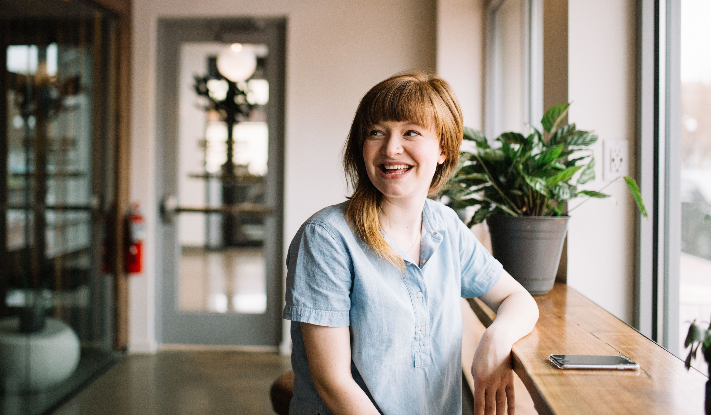

# Cara Watson

_Access services staff_

## Background

Cara works in a county archives in the Midwest, where she has recently transitioned to a full-time position after working there part-time for 2 years. Cara is 28 years old, and lives in an apartment with her cat Milo. She likes to run, and participates in local running events for charity. Cara is also interested in genealogy, and is inspired to see researchers connect personally to their family's history through local historical materials. She attends community talks and events about local history whenever she can, and always promotes her archives' public programs.

## Goals and Motivations

Her work at the archives is focused on supporting archival operations through digitization, pulling and reshelving requested materials onsite, and organizing the movement of boxes to and from an offsite storage facility. Sometimes she communicates directly with researchers to fulfill digitization requests, but most of her work is mediated through systems that facilitate different types of user requests. Cara values efficiency in process and communication.

## Needs

Cara manages and tracks a lot of requests, and needs the systems and workflows she uses to streamline communication and reduce redundant actions. She also has to keep track of multiple types of requests, and needs tracking systems that can help her view and quickly update the status of these and know what to prioritize. For on-demand digitization work, she needs to have clearly defined timelines and a delivery system for the digital files that enables users to easily access materials.

## Pain Points

Cara isn't always sure what to prioritize in her work as she tracks multiple types of requests in various formats. For archival material that has access or use restrictions for researchers, Cara struggles to coordinate with her coworkers to understand the specifics of restrictions and apply them consistently without unnecessarily limiting access. She doesn't always feel like her coworkers know and appreciate the specifics of her work, and while she knows she is doing a good job, she would like her processes to be visible both on a personal level, and to clarify expectations and improve processes. Cara has intermittent back pain and is conscious about the physical labor involved with repeatedly lifting and moving boxes of archival material. Because of this, she wants to be as efficient and strategic as possible with physical work.

## Current Devices, Apps & IT Use

Cara is generally comfortable with technology, but likes to get her systems and devices set up in the ways that work for her, and doesn't have time to experiment with new tools or programs. She primarily uses Windows, and has taken a couple short online tutorials for Python, but feels a little confused and overwhelmed by "coding". She took a database course in college, and has created small Microsoft Access databases for her work in the past. In her day-to-day work Cara uses spreadsheets, project management software, a request tracking system, and the archives' digitization software.
