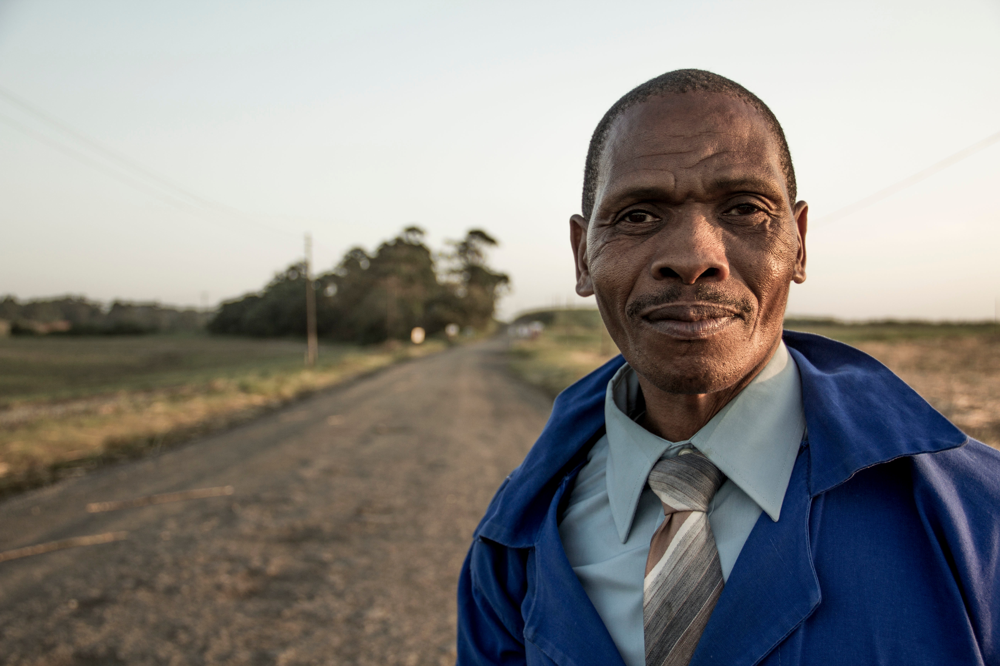

# Marc Richards

_Historian_

## Background

Marc is a historian living in Denver, Colorado. He’s 47 years old and single. He has a PhD in American History from the University of Colorado, and he’s currently working on his next book. Marc’s on sabbatical from his teaching position at a small college and is working full time as a historian. He has intimate knowledge of archival research and has traveled to a few different archives for work. He’s a huge music buff, and likes to consume modern popular media in his spare time in order to escape from living and working with documents about the past.

## Goals and Motivations

Marc wants to make a name for himself as an author, and he is hoping his book will be a good starting-off point to grow his brand as an historian. As a historian, he is concerned about the authenticity and context for all of the materials he’s looking at. He’s trying to piece together a bigger picture from the corpus of documents and have them help him tell a story. His book project is new and still in the research phase. This is not grant-funded research, so access to materials online is important to him. His ultimate goal is possibly to turn his book into a documentary film or video if it is popular enough.

## Needs

Marc’s goal is publishing, so he needs clear and concise access and use statements for researchers. He’s performing most of his discovery offsite, so online access to materials helps him greatly. While he’s experienced with archival research, he’d like robust search and discovery systems to help him find materials. He looks at a lot of materials, and he needs a way to aggregate materials into groups that he finds more useful. He’d also like to be able to download materials from the web directly to his personal computer so he can organize them at will. The context of how the records were created and maintained are important to his work, so he wants to be sure that everything he’s looking at has supporting information about its content and context. Finally, because he plans to publish his results, he needs a way to create citations for the material he’s looking at.

## Pain Points

He’s self-funding his work, so Marc has limited funds to spend on travel to an archive. He wants to be sure that an archive has valuable materials before visiting. Marc is primarily versed in working with paper materials, but his current project requires working with digital objects, which he is less familiar with. Use restrictions are often unclear. Sometimes he feels like archivists are not clearly describing the material in language he can understand. Marc also sometimes has difficulty working with archivists because it sometimes feels like they’re trying to control his research and are too hands on.

## Current Devices, Apps & IT Use

Marc is comfortable with computers, but not a power user. He mostly works with Microsoft, Zotero, and other text-editing programs. He has an iPhone that he uses to photograph materials, but he doesn’t work from it often. He has never worked with the command line.
