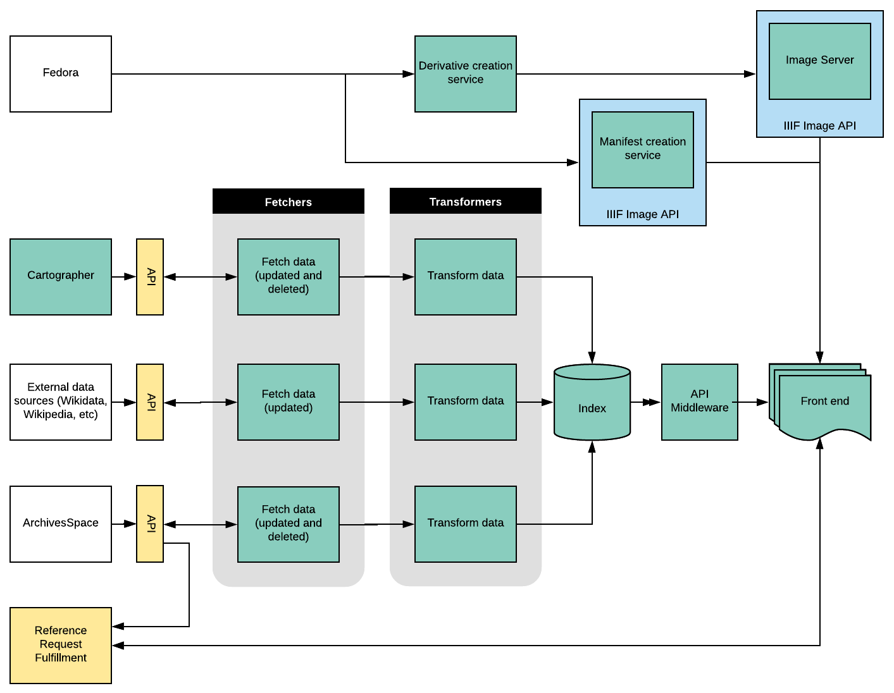
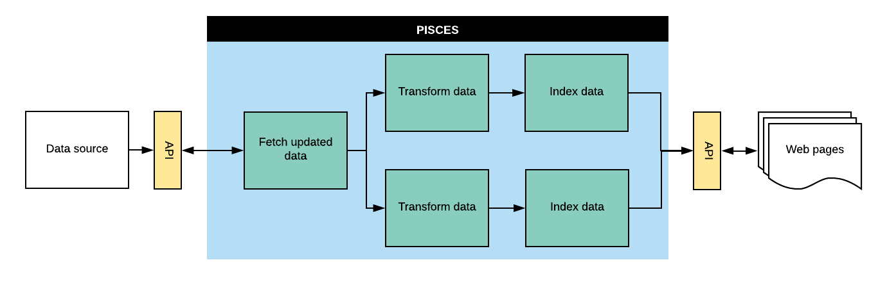

# RFC 001: Discovery and Delivery

Last updated: September 21, 2019

## Background
A patchwork of systems currently supports discovery and delivery of archival records:
  - DIMES (a heavily customized version of XTF) provides access to archival description serialized as EAD, some digitized records (things we are comfortable providing access to on the open web), and integrates with Aeon for request management.
  - Archival description created and managed in ArchivesSpace is exported as EAD each night, versioned using git, and indexed in DIMES. This process is brittle and fairly opaque, and has been a fairly consistent source of pain for several years.
  - An Apache server hosts digitized content that is available on the open web.
  - Virtual Vault (Jekyll) delivers digitized content (moving image, audio, PDF) within the RAC network only. Access derivatives are hosted on the Virtual Vault’s server filesystem.
  - Aeon handles request management through a separate web interface.

To help meet our goal of providing broad and equitable access to archival records, we need to more fully articulate a delivery layer which supports a range of digitized and born-digital records and replace unsupported systems and technologies.

## Proposed Solution

### Overall goals

#### Improve user experience
  - WCAG 2.0 AA compliance
  - Provide support for RAC data model, which more fully and accurately represents the archival description generated by our workflows.
  - Allow users to browse archival relationships between groups of records, agents and subjects. These are all different kinds of relationships and will require different data structures.
  - Provide a fast, device-responsive and visually appealing interface.

#### Improve reliability
  - Ensure that archival description in the system is always up to date
  - Improve logging and failure recovery of processes which fetch data from data sources, transform, and index it.
  - Reduce reliance on data formats with a high serialization overhead (EAD)

#### Separate discovery and delivery layers
  - Create stable abstractions (APIs) for archival description and digitized/born-digital records
  - Support delivery of a wide variety of digitized and born-digital content
  - Allow for better access controls so we don’t need multiple delivery systems

#### Allow for use of non-RAC-created data in archival description
  - Pull data from select external sources, like Wikidata, through fetchers
  - Ensure extensibility and scalability for more data sources over time

### System components
After conducting a review of existing third-party solutions, we realized that, although there are existing solutions that match pieces of our proposed architecture, all would require additional customization or further development. Given that all of the existing solutions were built in languages and frameworks in which we do not have local expertise, we decided that we’ll build our own system, with the following specifics:
  - Three sets of services move data between data sources and an Elasticsearch index, which will be the persistence layer for the discovery layer. These services will be built in Django and integrated with the existing Zodiac API Gateway environment, which allows us to take advantage of the messaging queue and UI within Zodiac:
    - Fetchers, which get data from data sources.
    - Transformers, which map data between predefined formats.
    - Mergers, which merge transformed data from different sources.
    - Indexers, which add, update or delete transformed and merged data in an index.
  - API middleware produces an API which can be used by clients to search and display data stored in the index.
  - A frontend provide a user interface to search and browse archival description, and view digitized and born-digital records.

#### Fetchers
  - Each fetcher will be targeted to a specific data source, and will return new, updated or deleted information.
    - These data sources may be RAC-controlled data and systems as well as data sources outside of our control
    - Since each fetch will likely return a changeset of multiple objects, it should be able to trigger multiple chains of transformation and indexing processes, each of which is scoped to a specific object.
  - Fetch services run independently of one another, and can be deactivated or implemented without impacting other fetchers.

#### Transformers
  - Each transform service is targeted at a particular data source, and produces data which complies to the RAC data model.
    - Data structures are described by Odin Resources
    - Mappings between data structures are described by Odin Mappings
  - Transform processes are triggered by fetch services

#### Merger
  - Looks to see if a transformed object already exists in the index and if it does, merges the two objects.
  - Delivers the merged object to a queue to be indexed.

#### Indexer
  - The indexing service consumes an indexing queue and adds, deletes or updates Documents in bulk.
  - Relationships to other Documents are also created or updated by this service.
  - When necessary, this service mints persistent identifiers to be used in the index.
  - The elasticsearch-dsl library will be used for Document definitions as well as to provide a client for interacting with the Elasticsearch API.

#### API Middleware
  - Middleware which formats data from Elasticsearch into a more generic structure required by the frontend.
  - Over time, other systems and services may consume this API.
  - The data returned in API responses will be determined by need; only data for which there is a specific use in the frontend will be returned. The API will therefore take a minimal approach, and data elements will be added as needed.

#### Frontend
  - Currently specified minimally in wireframes
  - Technical decisions about language/framework are still pending
