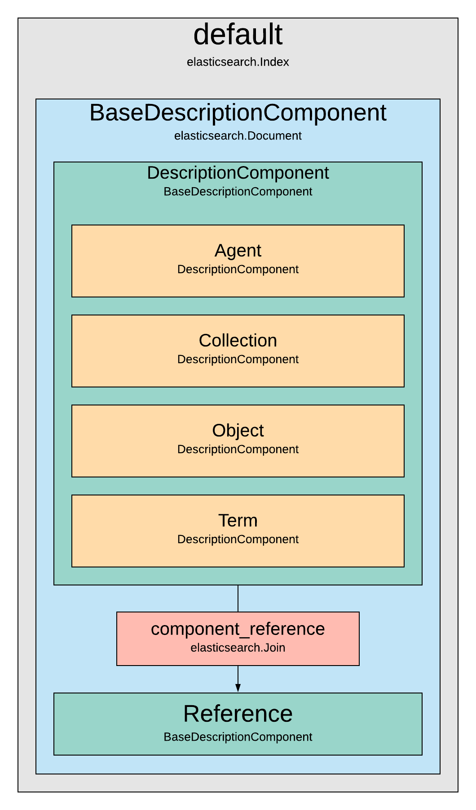

# RFC 003 - Indexing

Last updated September 10, 2019

## Background
Indexing processes for archival data can be opaque, but have a huge impact on discovery environments and their ability to meet users' needs. The underlying logic for these processes should be clearly articulated so that we can diagnose downstream impacts.

## Solution

### Indexing technology
  - We use Elasticsearch as an indexing technology
  - Documents are indexed in a single index
  - There are five first-class objects which are indexed:
    - `Agents`: people, organizations or families.
    - `Collections`: groups of archival records.
    - `Objects`: groups of archival records at the lowest level of aggregation.
    - `Terms`: topics, geographical areas, document types or other controlled terms.
    - `References`: a condensed reference to a document, used in parent-child relationships (see below).
  - Each of these types can have relationships to all the other types.
  - These object types are articulated as Elasticsearch `Documents` in a RAC-maintained Python package.



### Denormalizing data
One of the key differences between an Elasticsearch index and a database is that data is expected to be denormalized in an index, rather than structured into separate tables connected by keys, as in a database. This process of denormalization is one of the most important and complex pieces of indexing.

As a general principle, we try to ensure that any data needed in a user interface is created at the time of indexing, rather than generated by serializers on request. This ensures faster response times for API requests, and removes some of the burden from API middleware.

#### Representing Relationships
Archival data is highly relational. Representing these relationships is particularly challenging given that Elasticsearch stores data in flat structures. For a general overview of approaches to managing relations in Elasticsearch, see [this blog post](https://www.elastic.co/blog/managing-relations-inside-elasticsearch), which describes several approaches.. We use parent-child relationships to link first-class objects to each other via a `Join` field.

During indexing, each object performs two sets of actions which resolve relationships in both directions:
  - A "look up" to find relationships to itself in other Documents
  - A "look down" to find other Documents to which it has relationships.

In both cases, `Reference` objects are created or updated which record the relationship type. API middleware then queries these relationships and produces the appropriate output.

For example, the following external identifier object may be delivered to an indexing service:

```
{
  "external_identifiers": [
    {
      "source": "archivesspace",
      "identifier": "/agents_people/1"
    }
  ]
}
```

Post-indexing, this data would appear in the RAC API as:

```
{
  "title": "Donald Duck",
  "uri": "agents/fuaLyxZWnz5NPHJfwErEHP",
  "relation": "creator"
  "external_identifiers":  [
    {
      "source": "archivesspace",
      "identifier": "/agents_people/1"
    }
  ]
}
```


### Special fields

#### `source_identifier`
During indexing, a `source_identifier` field is added to each external identifier for all first-class objects (`Agents`, `Collections`, `Objects`, `References` and `Terms`). This field concatenates the source and the identifier values, thereby creating a truly unique identifier which can be used in queries.
