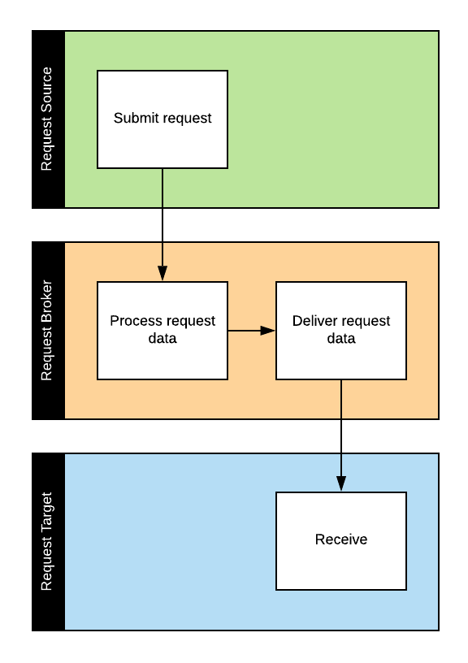
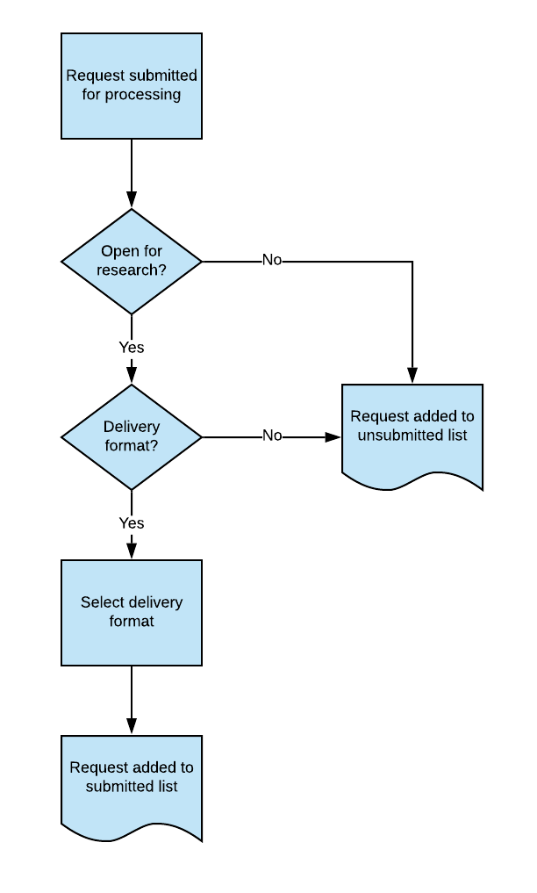

# RFC 006 - Request Broker Service

Last updated July 21, 2020

## Background/Problem Statement

The RAC provides a discovery environment for users to search for archival records of interest. After finding relevant records, they often need to do something with the results of their search:
- Submit a request to view these records in the reading room
- Request copies of the records
- Download, print or email some data about these records

Although users can do many of these things in our current version of DIMES, the code which supports these functions is embedded throughout the application code of XTF, which makes it difficult to maintain or improve this functionality without impacting core application logic, such as indexing and display of search results.

Since we are about to move to a new generation of DIMES, we have an opportunity to rethink this integration pattern.

## Proposed Solution

We propose the development of a request broker service, which would encapsulates the logic required to process requests submitted by users.



### Endpoints and actions
The service will provide the following three endpoints, each of which would provide its own logic:
- `reading-room-request` - submits request(s) to the RAC's request management system (Aeon)
- `duplication-request` - submits request(s) to the RAC's digitization process management system (Aeon)
- `download` - returns a streaming comma-separated values (CSV) file
- `email` - sends an email with request data to an email address or list of addresses

#### Reading Room and Duplication Requests
Reading room and duplication requests are both delivered to Aeon and follow a common process:
- Additional data is fetched from ArchivesSpace
- The updated request data is processed and a final list is presented to users for confirmation (see below)
- The final request data is delivered to Aeon

##### Request Processing Summary
The purpose of the request processing logic specified below is to limit the number of unfulfillable requests which are submitted to Aeon, and to provide meaningful feedback to users which indicates whether or not their requests were submitted, and why.

The request processing flow consists of three main steps, each of which are explained in detail below:
- Evaluating access restrictions on the records requested
- Determining if the requested records have one or more delivery formats
- Selecting the appropriate delivery format

The process described below is applied to each group of records in a request. During either of the first two steps, groups of requested records may be marked as unrequestable, at which point they will be added to an "unsubmitted requests" list along with a message indicating the reason they cannot be submitted. Requests for groups of records which pass the first two tests will be submitted to Aeon. Both the submitted and the unsubmitted lists will be returned to users in a user interface at the end of the request processing flow.



##### Detailed Process Steps

###### Evaluating Restrictions
Requested records will first be evaluated for restrictions by analyzing data elements in the following order:
1. Any PREMIS Rights statements associated with the records which articulate machine-actionable rights.
2. Conditions Governing Access notes associated with the records, which can be parsed for strings indicating the presence or absence of access and/or use restrictions.
3. The next closest Conditions Governing Access note (i.e. from a parent series or collection).

There are three relevant access statuses for records:
- Open: records are available for research in the RAC’s reading room and/or on its internal network, and duplication requests for these records can be fulfilled. Requests for these records will be passed along to the next step in the process.
- Conditionally Restricted: records can be accessed by researchers in certain circumstances, but depend on workflows which rely on human judgement and intervention. Requests for these records will be passed along to the next step in the process but will be flagged as "conditionally restricted".
- Restricted: records are completely restricted from access and may not be duplicated due to donor agreements and/or RAC policy. Requests for these records will be marked as "unsumittable" and added to the unsubmitted list along with a message indicating the request cannot be fulfilled because the records are restricted.

Records are assumed to be open unless they are explicitly restricted.

###### Checking for Available Delivery Formats
In this step, requests are evaluated to ensure that they are not for a series or some other unit of description which does not represent a requestable aggregation of records. In order to pass this step, records associated with a request must meet at least one of the following criteria:
- One or more instances are associated with the records
- One or more digital object links are associated with the records

Requests for records which do not meet either criteria will be marked as "unsubmittable" and added to the unsubmitted list along with a message indicating that the request is not associated with a requestable group of records. Requests for records which meet one or more of the above criteria will be passed along to the next step.

Depending on choices made in the DIMES interface, this step may not be necessary, but it is articulated here for the sake of comprehensiveness.

###### Selecting a Delivery Format
Records which pass the above two tests are requestable and can be delivered to users. The last step is to determine the best delivery format.

Duplication requests will always be submitted for the user’s preferred delivery format. If a digital surrogate is available (indicated by the presence of a digital object link), the request data will include a flag to notify RAC staff that digital surrogates of the records already exist. This is because offsite researchers may not be able to see those digital surrogates in the DIMES interface, and will likely need assistance from an archivist to get access to those records.

For reading room delivery, format preference will be evaluated as follows:
- Digital (indicated by a digital object link): if digital surrogates are available, the request will be marked as "unsubmittable" and added to the unsubmitted list along with a message indicating that digital surrogates already exist, along with a link to the digital records in DIMES.
- Microfilm (indicated by an instance of type "microform"): if digital surrogates are not available but microfilm surrogates are, the request will be marked as "submittable" and added to the submitted list..
- Mixed materials (indicated by an instance of type "mixed materials"): If neither digital nor microfilm surrogates are available, the request will be marked as "submittable" and added to the submitted list.

### Authentication
The service will accept only requests from known sources, identified by an API key.

### Request Data Model

At minimum, requests specify a list of items.

```
{ "items":
  [
    "/repositories/2/archival_objects/1263",
    "/repositories/2/archival_objects/1264"
  ]
}
```

Additional data elements may be provided as needed. Each endpoint will likely require different data elements.

```
{ "to_address": ["test@example.org"],
  "subject": "Stuff from DIMES",
  "body": "Here are some useful records I found today.",
  "items":
  [
    {
      "creator": "Ford Foundation",
      "barcode": "A0000000037985",
      "collection_name": "Ford Foundation records, General Correspondence",
      "aggregation": "General Correspondence",
      "dates": "1951-1960",
      "location": "Rockefeller Archive Center, Blue Level, Vault 106 [Cabinet: 11a, Drawer: 2]",
      "resource_id": "FA735",
      "container": "Reel C-1138",
      "title": "Adler, Mortimer J.",
      "restrictions": "Closed until further notice due to personally identifying information.",
      "ref": "/repositories/2/archival_objects/986296"
    }
  ]
}
```

### Important Caveats
Since it is envisioned largely as a passthrough, this service would have a minimal UI. Users will not be able to create requests directly in the application. Additional user research will be conducted to determine if they need to see a log of requests submitted and/or a list of errors. Additionally, the service will store only the bare minimum of data necessary to avoid saving personally identifying information or data that primarily lives in other systems.
